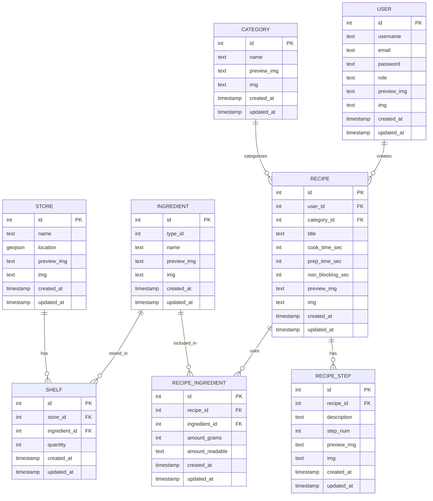

# Database

## Entity Relation Diagram

Columns `preview_img`, `img`, `created_at`, `updated_at` should be implemented as a superclass `Entity` that should be inherited from when implementing `user`, `store`, `ingredient`, etc.
